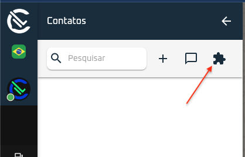
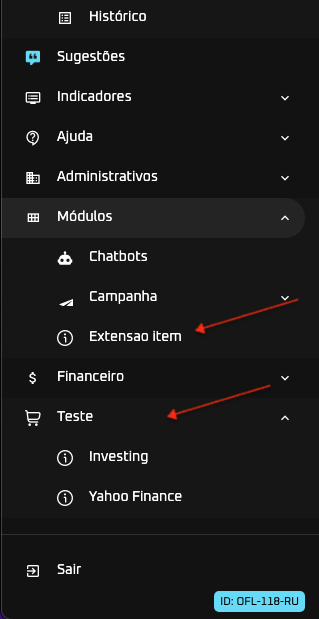

# Exemplo extensão WL.

Montamos uma pequena biblioteca javascript para facilitar a interação com nosso sistema. Ele fornece um objeto global `window.WlExtensions`, para utilizar basta importar a biblioteca no seu arquivo html.

### Lista de métodos da `window.WLExtensions`

 - [WLExtensions.initilize(options);](initilize)
 - [WLExtensions.modal(options);](#modal)
 - [WLExtensions.closeModal();](#close-modal)
 - [WLExtensions.alert(options);](#alert)
 - [WLExtensions.confirmDialog(options);](#confirm-dialog)
 - [WLExtensions.alert(options);](#alert)
 - [WLExtensions.getInfoChannels();](#get-channels)
 - [WLExtensions.getInfoUser();](#get-user)
 - [WLExtensions.openPage();](#open-page)

Ex:

~~~

~~~

--------

## .initilize  

- Após importar podemos utilizar a função `window.WlExtensions.initilize()` para definimos botões e ações que será definida quando sua extensão for carregada no sistema;

### Botões de ações

  Podemos definir botões no topo da lista de contatos,lista de atendimento ou topo da tela atendimento.

- Lista de contatos, `contacts-list`

- Lista de atendimento, `attendance-list`

- Topo da tela atendimento, `attendance-view`

### Novo menu na navbar

Tambem podemos definir novos menus, precisamos somente definir a opção `navbar` dentro de `.initilize()`.

~~~
  navbar: [
    {
      id: 'group_extension',
      icon_url: 'http://localhost/docs/shopping.png',
      text: 'Teste',
      type: 'group',
    },
    {
      id: 'ext_1',
      type: 'item',
      icon_url: 'http://localhost/docs/info.png', // icon 16x16
      text: 'Extensao item',
      parentId: 'modules',
      callback: () => {
        window.WlExtension.openPage({
          url: "https://br.widgets.investing.com/live-currency-cross-rates?theme=darkTheme"
        })
      }
    }
  ]
~~~

Opções de tipo de menu:
- `group` - cria um grupo.
- `item` - Cria um botão, podemos pegar evento `callback` na propriedade quando for clicado.

Tambem podemos criar um item dentro de um menu já existente, colocando o id do grupo na propriedade `parentId`, hoje temos seguinte grupos de menu.

- Atendimentos  id: `services`
- Indicadores id: `indications`
- Ajuda id: `help`
- Administrativos id: `admins`
- Módulos id: `modules`
- Financeiro id: `financial`

Ex: 

~~~
  window.WlExtensions.initilize({
    buttons: {
      'contacts-list': [
          {
            text: 'Botao Alert',
            callback: () => {
              window.WlExtension.alert({
                message: 'Mensagem de sucesso',
                variant: 'success'
              });
            },
          }
        ],
        'attendance-view': [
          {
            text: 'Ver Perfil',
            callback: (atendimento) => {
              window.WlExtension.modal({
                url: `http://localhost/info-atendimento.php?atendimentoId=${atendimento.atendimentoId}`,
                title: 'Perfil',
                maxWidth: '500px',
                height: '300px'
              });
            },
          }
        ]
    },
    navbar: [
      {
        id: 'group_extension',
        icon_url: 'http://localhost/docs/shopping.png',
        text: 'Teste',
        type: 'group',
      },
      {
        id: 'ext_1',
        type: 'item',
        icon_url: 'http://localhost/docs/info.png', // icon 16x16
        text: 'Extensao item',
        parentId: 'modules',
        callback: () => {
          window.WlExtension.openPage({
            url: "https://br.widgets.investing.com/live-currency-cross-rates?theme=darkTheme"
          })
        }
      },
      {
        id: 'ext_2',
        type: 'item',
        icon_url: 'http://localhost/docs/info.png', // icon 16x16
        text: 'Investing',
        parentId: 'group_extension',
        callback: () => {
          window.WlExtension.openPage({
            url: "https://br.widgets.investing.com/live-currency-cross-rates?theme=darkTheme"
          })
        }
      },
      {
        id: 'ext_3',
        type: 'item',
        icon_url: 'http://localhost/docs/info.png', // icon 16x16
        text: 'Yahoo Finance',
        parentId: 'group_extension',
        callback: () => {
          window.WlExtension.openPage({
            url: "https://finance.yahoo.com/quote/YM%3DF?p=YM%3DF"
          })
        }
      },
    ]
  })
~~~

*Nos botões tipo `attendance-view` o callback retorna um objeto no primeiro argumento com atendimento em foco.*

# Funções adicionais

## Abrir modal 

~~~
  window.WlExtension.modal({
    title: 'Cotações de moeda',
    url: 'https://br.widgets.investing.com/live-currency-cross-rates?theme=darkTheme', // URL da pagina para abrir iframe.
    maxWidth: '500px', // px ou %
    callback: (args)=>{
      alert('Fechou Modal');
    }
  });
~~~

## Fecha modal 
ao usar funcao `.closeModal()` podemos um objeto com argumentos para recuperar no callback definido na função `.modal({})`.

~~~
 window.WlExtension.closeModal({
    name: 'teste',
    number: '659994837726'
  });
~~~

## Emitir alerta 
Tipo diponiveis de alerta: ``sucess`` / ``error`` / ``warning``

~~~
 window.WlExtension.alert({
    message: 'Alert da suceso',
    variant: 'success' // success, error, warning
  });
~~~

## Abrir tela de confirmação 

~~~
  window.WlExtension.confirmDialog({
    title: 'Dialog de confirmação',
    text: 'Exemplo de texto para tela de confirmação.',
    callback: (confirm) =>{
      alert('Resultado: ' + JSON.stringify(confirm));
    }
  });
~~~

## Abrir um alerta 

~~~
  window.WlExtension.alert({
    message: 'Alert da suceso',
    variant: 'success' // success, error, warning
  });
~~~

## Busca lista de canal disponível para usuário 

~~~
  window.WlExtension.getInfoChannels()
    .then((channels) => {
      
    });
~~~

## Busca infomação do usuário logado. 

Função retorna um objeto com `userId` e `systemId`.

~~~
   window.WlExtension.getInfoUser()
    .then((data) => {
      console.log(data.userId);
      console.log(data.systemKey)
    })
~~~

## Abrir página dentro do sistema 

~~~
  window.WlExtension.openPage({
    url: 'https://br.widgets.investing.com/live-currency-cross-rates?theme=darkTheme'
  });
~~~